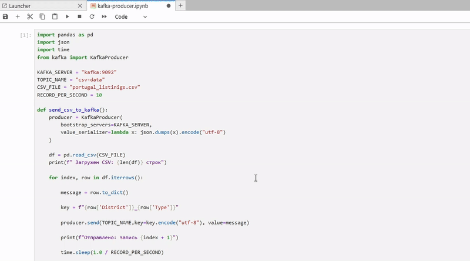
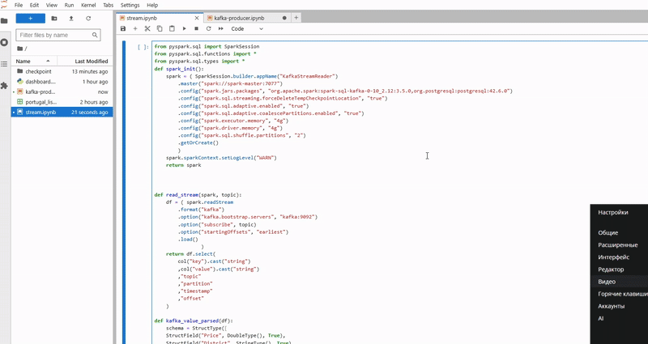
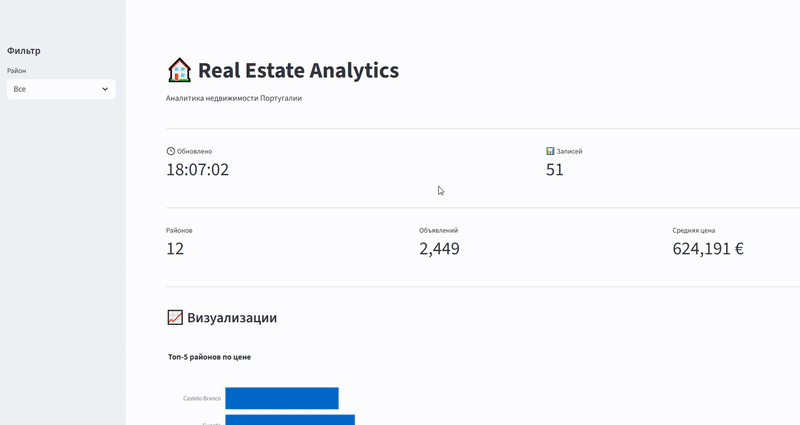

# Проект потоковой аналитики недвижимости

Этот проект реализует потоковый конвейер данных для анализа недвижимости Португалии в реальном времени с использованием Kafka, Spark, PostgreSQL и Streamlit. Данные обрабатываются из [датасета Portugal Real Estate 2024](https://www.kaggle.com/datasets/luvathoms/portugal-real-estate-2024), эмулируется поток, выполняются агрегации, результаты сохраняются в базе данных и визуализируются на динамическом дашборде. Проект запускается с нуля: база данных и Kafka-топик очищаются при каждом старте.

## Описание проекта

Конвейер:
1. **Эмуляция потока**: Отправляет объявления недвижимости из CSV в Kafka (10 записей/сек). Топик создается автоматически.
2. **Обработка в реальном времени**: Spark Streaming фильтрует, группирует и агрегирует данные.
3. **Сохранение**: Записывает агрегации в PostgreSQL каждые 30 секунд (таблица пересоздается).
4. **Визуализация**: Отображает метрики, графики и таблицу на дашборде Streamlit с автообновлением каждые 15 секунд.

## Технологический стек
- **Docker и Docker Compose**: Контейнеризированная среда.
- **Apache Kafka 3.6.1**: Брокер сообщений.
- **Apache Zookeeper 3.9.2**: Координация для Kafka.
- **Apache Spark 3.5.0**: Обработка потоковых данных.
- **PostgreSQL 15**: Хранилище агрегированных данных.
- **Jupyter Notebook**: Среда для разработки.
- **Streamlit**: Веб-дашборд.
- **Библиотеки Python**: `pandas`, `kafka-python`, `pyspark`, `sqlalchemy`, `plotly`, `streamlit`, `psycopg2-binary`.

## Структура проекта

SPARK-KAFKA-STREAMING/
├── app/                        # Основное приложение
├── notebooks/                  # Jupyter notebooks и скрипты
│   ├── dashboard.py           # Dashboard приложение
│   ├── kafka-producer.ipynb   # Kafka producer
│   ├── portugal_listings.csv  # Набор данных
│   └── stream.ipynb          # Streaming обработка
├── checkpoint/                 # Spark checkpoints
├── screenshots/               # Документация (скриншоты, видео)
├── docker-compose.yaml        # Docker композиция
├── Dockerfile                 # Docker образ
├── init.sql                  # Инициализация базы данных
└── README.md                 # Документация проекта

## Требования
- Установлены **Docker** и **Docker Compose**.
- Скачан датасет `portugal_listings.csv` с [Kaggle](https://www.kaggle.com/datasets/luvathoms/portugal-real-estate-2024) и размещен в папке `notebooks/`.
- Достаточно памяти для Docker (рекомендуется минимум 8 ГБ).

## Установка и запуск с нуля

Следующие шаги обеспечивают запуск проекта с чистой базой данных и сброшенным состоянием:

1. **Клонируйте репозиторий**:
   ```bash
   git clone https://github.com/bludeep/spark-kafka-streaming-project.git
   cd SPARK-KAFKA-STREAMING-PROJECT
   ```


2. **Запустите сервисы Docker**:
   ```bash
   docker compose up -d
   ```
   - **Ожидаемый вывод**: Запустятся 7 контейнеров (zookeeper, kafka, spark-master, spark-worker-1/2, jupyter, postgresql).
   - **Проверка**: `docker ps` — все контейнеры в статусе `running`.

   

3. **Проверьте пустую БД**:
   - Подключитесь к PostgreSQL:
     ```bash
     docker exec -it postgresql psql -U spark_user -d realestate -c "SELECT * FROM real_estate_analytics;"
     ```
   - **Ожидаемый вывод**: "0 rows" (таблица пуста, так как пересоздается в `init.sql`).


4. **Запустите Kafka Producer**:
   - Откройте Jupyter: `http://localhost:8888`, перейдите в `notebooks/kafka-producer.ipynb`.
   - Выполните код в первой ячейке.
   - **Ожидаемый вывод**:
     ```
     Топик csv-data успешно создан.
     Загружен CSV: 135536 строк
     Отправлено: запись 1
     Отправлено: запись 2
     ...
     ```
   - Топик `csv-data` создается автоматически при первой отправке (если не существует).
   - **Проверка**: `docker exec -it kafka kafka-console-consumer.sh --bootstrap-server localhost:9092 --topic csv-data --from-beginning --max-messages 10` — выводит JSON-записи.



5. **Запустите Spark Streaming**:
   - В Jupyter: Откройте `notebooks/stream.ipynb` и выполните ячейку.
   - **Ожидаемый вывод**: Логи Spark в консоли Jupyter, Spark UI (`http://localhost:8080`) показывает активный стриминг.
   - **Проверка**: Через 30 секунд:
     ```bash
     docker exec -it postgresql psql -U spark_user -d realestate -c "SELECT * FROM real_estate_analytics LIMIT 5;"
     ```
     Увидите агрегации (district, property_type, avg_price, total_ads, avg_price_per_sqm).




6. **Запустите дашборд**:
   - Команда:
     ```bash
     Открываем терминал в jupyter и вводим --   streamlit run dashboard.py --server.port 8501 --server.address 0.0.0.0
     ```
   - Откройте: `http://localhost:8501`.
   - **Ожидаемый вывод**: Дашборд с метриками (Обновлено, Записей, Районов, Объявлений, Средняя цена), гистограммой (топ-5 районов), круговой диаграммой (типы недвижимости) и таблицей. Время в метрике "Обновлено" меняется каждые 15 секунд. Если БД пуста, отображается предупреждение: "Данные отсутствуют".
   - **Проверка**: В терминале Streamlit видны логи:
     ```
     Загружено 0 строк из БД
     Обновление дашборда: 2025-09-02 16:58:00
     ```
     После запуска `stream.ipynb` логи покажут `Загружено X строк из БД`.



7. **Остановка и очистка**:
   - Остановить: `docker compose down`
   - Очистить БД: `docker volume rm sparkstreamingproject_postgres_data`


## Соответствие ТЗ
- **Эмуляция потока**: 10 записей/сек из CSV, топик создается автоматически.
- **Обработка**: Фильтрация (цена >50k €, площадь >20 м²), группировка (property_type, district), расчет метрик (средняя цена, площадь, количество объявлений, цена за м²).
- **Обновление**: Агрегации в БД каждые 30 сек.
- **Хранение**: PostgreSQL (`real_estate_analytics`, пересоздается).
- **Визуализация**: Streamlit дашборд с автообновлением (15 сек).
- **Запуск с нуля**: БД очищается, чекпоинты сбрасываются.
